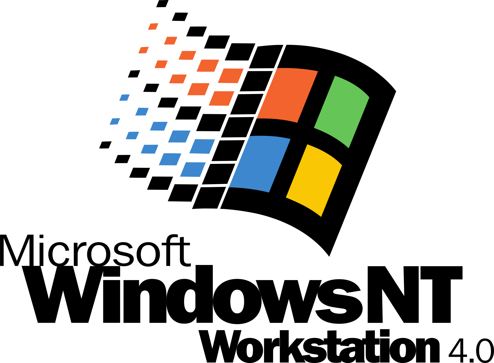

# Degen Art Win32 &nbsp;

<p align="center">

</p>

## About

A small Windows NT 4.0+ compatible program that plays music while generating abstract art.  



The app is written in raw Win32 API, using C++. NOTE: Some of this has been written with the help of Claude Code, so not every line is my own work.

Modified from a [source](https://github.com/recombinant/petzold-pw5e) originally from [Charles Petzold](https://www.charlespetzold.com/), master Win32 programmer :)

__*Why is it named Degen Art?*__  

&#49;&#46;&nbsp;As a way to make fun of Hitler.  
Huh? Why? He famously called many new artists and art forms, including abstract/surrealist art, "degenerate art". -> https://en.wikipedia.org/wiki/Degenerate_art  

Some artists died as a result, and there is much artwork that has been lost because of it.

&#50;&#46;&nbsp;But also, most art generation programs are called "Generative", so this is a play on words by calling it "DeGen(erative) Art".

I couldn't think of a name, so, well there you go. My dark humour prevails lol.  

## Building

### Via MinGW
Use the Makefile or `build_mingw.sh`. It should work on Linux, and with MinGW on Windows.  
You can also use my fork of [w64devkit](https://github.com/skeeto/w64devkit), called [win32-devkit](https://github.com/Alex313031/win32-devkit).

Using this method, you can compile on Linux, or Windows XP+ (using win32-devkit).

```
make -B all -j# (where # is number of jobs)

```

### With GN/Ninja
[Chromium](https://www.chromium.org) uses a build system with [GN](https://gn.googlesource.com/gn/+/refs/heads/main/README.md) and [Ninja](https://ninja-build.org/).

I have made a minimal, modified version configured specifically for compiling Win32 programs
for legacy Windows called [gn-legacy](https://github.com/Alex313031/gn-legacy).  
It can be used on Windows 7+ or Linux. (Unlike the regular MinGW method above, gn.exe does not work on Windows XP/Vista.)

Really, it is a meta-build system. GN stands for "Generate Ninja" and can use __BUILD.gn__ files to
generate `.ninja` files. These are used by Ninja (the actual build system), to run the commands to compile it.  
The compiler itself is dependant on the host platform:  
On Linux, a special MinGW build I compiled on Ubuntu 24.04 to support legacy Windows and use static linkage is used.
On Windows, it simply uses an extracted toolchain from win32-devkit mentioned above.

### With Visual Studio 2005
 - Build files for MSVS 2005 are provided.
 Why such an old version? Because it's the last version that runs on Windows 2000, and is the last version that supports targeting Windows NT 4.0 (and Windows 98).

### Resources/Credits

BetaWiki.com https://betawiki.net/

Charles Petzold - [Programming Windows 5th Ed.](https://www.charlespetzold.com/books/)

Audio - [WaterSky.xm (c) Ghidorah 2001](https://modarchive.org/index.php?request=view_by_moduleid&query=60900)
